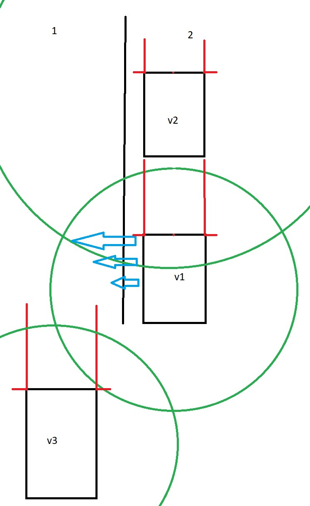

# Richieste di Davide

## 1) Come interagiscono le auto tra di loro
- Per prima cosa vogliamo far notare come il sistema di anti-tamponamento (segmento rosso), precedentemente creato sfruttando un singolo raycast posto al centro sul lato anteriore del veicolo, ora sia stato duplicato, ponendone due sullo stesso lato, ma agli estremi destro e sinistro. Questo perché, dopo molti ragionamenti, si è arrivato alla conclusione che un solo segmento, posto al centro, non fosse sufficiente per evitare il tamponamento tra due auto, quando quella di fronte stesse effettuando un cambio di corsia (un solo raycast, era sufficiente solo per evitare un tamponamento tra due auto poste nella stessa corsia).
In aggiunta, i due raycast (che ripetiamo essere uno uguale all'altro ma in due posizioni diverse), hanno lunghezza **direttamente** proporzionale alla velocità attuale dell'auto (con un valore minimo ed uno massimo da definire in fase di test in base alle necessità).
In aggiunta a questi due rayCast, ne sono stati posizionati altri due, laterali, con lunghezza fissa pari a $\ (W_{corsia} - W_{auto})/2$, dove $W = width$.
Questi due rayCast hanno lo stesso obbiettivo dei primi due, ma evitano tamponamenti laterali. Quando un rayCast laterale di un'auto v1 entra in contatto con con un'altra auto v2, l'auto v1 dovrà rallentare (o rientrare nella sua corsia?).
- **Se c'è un'auto davanti che è ferma, quella dietro cosa deve fare?**
    - L'auto dietro a quella ferma dovrà controllare se si trova sull'unica corsia disponibile in quel senso di marcia. In tal caso, deve arrestarsi (grazie anche al sistema di anti-tamponamento già presente) per poi avviarsi non appena la macchina davanti libera la corsia o si avvia.
    In caso contrario (vi sono almeno 2 corsie nello stesso senso di marcia [Da studiare come capire se il senso di marcia è quello giusto*]) l'auto deve prima controllare a sinistra, se vi è una corsia libera (nello stesso senso di marcia) deve iniziare la manovra di sorpasso dell'auto ferma. Se non vi è una corsia sulla sinistra (o non è libera), l'auto deve controllare a destra ed effettuare le stesse manovre descritte per la corsia di sinistra. Se nessuna delle corsie adiacenti è libera, l'auto deve rimanere ferma dietro l'auto che è davanti.
    - **Come fa v1 a sapere se vi è un'altra auto in una delle corsie adiacenti?**
    Abbiamo pensato che ogni auto debba avere, oltre ai 4 raycast anti-tamponamento, un circleCast (di colore verde). Questo cyrcleCast sarà estremamente utile in fase di cambio di corsia, quindi, utile anche per effettuare i sorpassi. Questo circleCast avrà un raggio **inversamente** proporzionale alla velocità di percorrenza dell'auto stessa. Quindi, più un'auto andrà veloce, più il raggio del circleCast sarà piccolo, fino ad un valore minimo pari a comprendere una volta e mezza la larghezza delle corsie attuali (così da permetterci di sapere se abbiamo un'auto accanto).
    Per giustificare ulteriormente il fatto che il raggio debba essere inversamente proporzionale, basti pensare a due casi, uno con un'auto veloce che vuole cambiare corsia ed uno con un'auto lenta. Quella veloce, creerà meno problemi nel cambio di corsia, in quanto, una volta coltrollato di non avere nessuna auto alla sua destra, non andrà a creare possibili tamponamenti con auto veloci presenti nella corsia nella quale vuole posizionarsi. Al contrario, l'auto lenta, potrebbe andare a tagliare la strada ad un'auto veloce presente nella corsia nella quale vuole posizionarsi.
    Il circleCast avrà come obbiettivo quello di individuare eventuali altre auto nel raggio d'azione del circleCast stesso.
    **NB**: in caso di phisics e non phisics2D possiamo considerare come circleCast un sphereCast (non cambia nulla al livello applicativo).
- **Ci sono le condizioni per un cambio di corsia?**
Nel caso di questa immagine, v1 non può passare dalla corsia 1 alla corsia 2, in quanto il suo circleCast sta colpendo l'auto v2. Questo indica che la velocità di v1 (raggio del circleCast) e distanza dall'auto v2 non sarebbero sufficienti ad effettuare un cambio di corsia in sicurezza (andrebbero ad incidentarsi le due auto o v2 sarebbe costretto ad inchiodare).

    - antitamponamento (raggio rosso) raycast direttamente proporzionale alla velocità di percorrenza (avanti) più due raycast laterali di lunghezza fissa e stabilita. In verde cyrclecast con raggio inversamente proporzionale alla velocità di percorrenza.

Per giustificare i raycast anti-collisione laterale basta guardare l'auto v3: in queste condizioni attuali potrebbe effettuare il cambio di corsia da corsia 1 a corsia 2, ma se per qualche motivo l'auto v1 rallentasse o avesse una velocità tale da arrivare ad avere v3 affiancata a v1 (quindi non dietro), senza il raycast laterale, si avrebbe che v3 potrebbe affiancarsi a v1 fino a toccarla e quindi tamponarla.
- Algoritmo per far evitare le collisioni (utile anche nel caso in cui ci sono ristringimenti/allargamenti di corsia).
    - Pensiamo che un buon algoritmo per il cambio di corsia, sfruttando i circleCast, possa sopperire anche a questa necessità di cambio di corsia nel caso di restringimento (ad esempio da due ad una corsia)
    - Ogni auto, prima di effettuare un cambio di corsia, controlla il suo circleCast e vede di non avere nessuna auta dietro a sinistra o dietro a destra (a questo fine è proprio ideale l'uso di un circleCast) in base alle necessità. Non importa al fine del cambio di corsia se ha un'auto perfettamente d'avanti o perfettamente dietro.
    

## 2) Implementare sistemi trasporto pubblico
- Qualsiasi trasporto pubblico (e.s. bus) dovrà sempre occupare la corsia più a destra evitando sorpassi.
- I mezzi pubblici avranno dei percorsi fissi ben stabiliti (similmente alle auto, ma con la differenza che ad ogni incrocio non si dovrà decidere in base al traffico il percorso più veloce, se l'autobus deve girare a sinsitra, girerà a sinistra), con delle fermate.
Il percorso del mezzo pubblico, verrà generato alla generazione della mappa, e verrà memorizzato nell'oggetto stesso (non sarà quindi l'incrocio a decidere la svolta a differenza delle auto).

## 3) [TODO] Implementare la parte di input del sistema
- Dalla matrice di quartieri, crea la città.

---
**Idea di classe street**
street 1
4 corsie [
{0: incr0 a incr1,
1: incr0 a incr1,
2: incr1 a incr0,
3: incr1 a incr0
]

Car0 si trova su una delle lanes di street1, e nella sua classe sa in quel momento di star percorrendo la strada nel verso che va dall'incrocio0 (incr0) all'incrocio1 (incr1), quindi le uniche lanes percorribili sulla street1 sono la lane 0 e la lane 1.