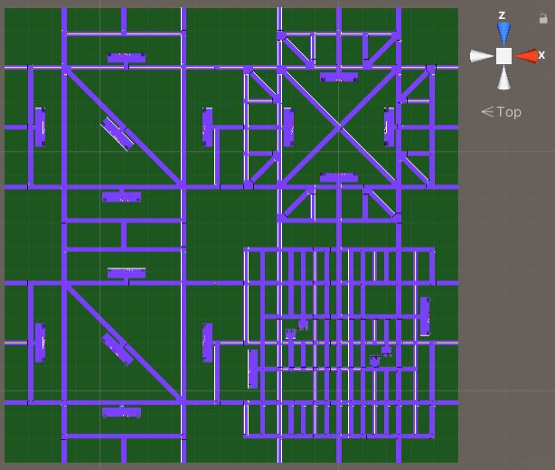

# Project report

This document is a summary of the work done to develop the traffic simulation project.

## Purpose of the project

The functional requirement of the project consists of a city traffic simulator, with a particular attention on its streets and vehicles.
The non-functional requirement is **high-scalability** in the number of vehicles and in general in the number of entities in the scene. Indeed, the purpose of the project is to evaluate the capabilities of Unity DOTS to support hundreds of thousands of entities in the scene at the same time.

## Dependencies

The developers have chosen not to use any external dependency, besides the core Unity libraries.

## The underlying technology: Unity DOTS

Unity recently offers two paradigms to build an application:

- Traditional stack: the well-established and mature approach to create three-dimensional (or bi-dimensional) programs in Unity, based on mono behaviours;
- DOTS: the Data-Oriented Technology Stack, a novel paradigm in building 3D (or 2D) applications. This is the target approach of this project.

DOTS is a paradigm that favours scalability in exchange for complexity. Hence, the data-oriented model suits projects that are characterized by a large or huge number of entities that obey to the same algorithm.

The community also talks about hybrid solutions, where mixing a small number of traditional scripts with DOTS is considered acceptable; in the context of this project, instead, the developers tried to stick to the Pure ECS paradigm, although Unity internally creates old-styled scripts anyway for some purposes.

## The first version of the project

The very first phase of the development approached the problem in a very flexible way. Essentially, the whole scene was created through scripts only. On one hand, this solution donated great flexibility since the input could be customized at a fine-grained level; on the other hand, generating all the components of the city on the fly came up to be time-consuming if compared to the results. The task was cumbersome for the final user as well, due to the great number of properties to configure.
Additionally, the developers at that time acknowledged their lack of experience on Unity and 3D frameworks overall.

## Why switching to the version 2?

After having explored the Unity ecosystem through the version 1 of this project, the developers switched to a new version. The reason of this was the need to increase the development process speed in exchange for a quite less customizability of the city, as discussed just above.

The former version can be considered as an *architectural spike*, namely a prototype that helps in going deeper into the specific domain of a project before proceeding to a complete solution.

## Version 2 characteristics

The second phase of the development process pertained the intent to build and deploy a full-fledged traffic simulator, on top of Unity DOTS. The paramount aspect of the second version is the usage of the physics to allow each component in the scene to interact with each other. The Physics package allows to reach a great degree of realism in the behaviour of the components inside the scene. For instance, cars continuously correct their trajectory along the lane, as in real life, rather than following invisible tracks.


An in-depth analysis on how the Physics package is exploited in version 2 is given in this same section of the README in the version2 branch.

## Why switching to the version 3?

The developers, once again, realized that realism was not a requirement of the project, especially if it thwarts scalability at a very limited threshold. Indeed, using Physics means loading Unity with a pletora of computations: collision surfaces and points, raycast and spherecast interpolation, gravity application, force computations and so on. Even if systems were partially but reasonably optimized, the resulting number of cars at steady state was unsatisfying. Systems were not able to run in parallel and some bugs were in place, but the developers traced back the poor performances to the usage of physics, which is therefore intended for few entities.

## The  simulator

*The following part of the document describes the final design and implementation of the simulator (version 3).*

### What's the input of the simulator?

The developers have conceived a general city as a matrix made up of square districts. Each district has predefined characteristics in terms of density. The scene under simulation can be customized as described beneath.

1. The user writes the city matrix as a json file called `city.json`. The user validates the json file against the [schema](./citySchema.json) in order to probe any syntax error;
2. The user saves the file in `<UnityRootFolder>/Assets/Resources/city.json`, as it is automatically loaded by the simulator so as to build the intended city.

### How does the simulator work?

*This paragraph discusses the solutions adopted for each component of the simulator to get to work.*

#### The city is a grid of districts

Given the json file that describes the districts selected by the user, the simulator essentially spawns the districts and welds them incrementally.

#### The city is a graph

Once the simulator has instantiated all the streets and crosses of the city, it proceeds to build the internal data structures.
The inner data structure that represent the city is a cyclic directed graph. The developers created a simple dedicated library for graph management, since most of the available ones in the community are not compatible with Unity, like the NuGet QuickGraph.

#### Cars move along splines

Each street is divided in forward and backward lanes; each lane contains a certain number of points, i.e. nodes.
These nodes are placed dynamically at run time on the streets, at the very beginning of the simulation. The longest the street is, the more nodes it will contain. On the crosses, instead, developers have chosen to place the nodes statically, since each type of cross has a fixed size.

At runtime, each car proceeds node by node along a trajectory, i.e. spline, that is the linear interpolation of two successive nodes. Cars therefore follow a series of splines that are located across streets and crosses.

Cars receive a random path at spawn time, that guides them from the source street/cross until the destination street/cross; the path is currently filled with streets and crosses choosen randomly.

### The output of the simulator

This section describes the measures taken into account in order to evaluate the simulator, along with their actual values on the three developers' machines. It follows a discussion on the collected results.

Note: *All measures have been collected when the simulation was at steady state.*

Among all the resources that Unity shows in the profiler view, like Scripts, Garbage Collector, Physics and so on, just two of them are relevant for the present simulation: Scripts and Others; indeed, the remaining categories don't show any relevant measure.

The bottlenecks of the simulator are the two main systems which allows the vehicles to move: SplineVehicleMovementSystem (SVMS) and SplineTrackAssignerSystem (STAS).

#### Machine 1

Hardware characteristics of the machine used for the simulation:

- CPU: Intel(R) Core(TM) i7-7500U CPU @ 2.70GHz;
- RAM: 8.00 GB;
- GPU: NVIDIA GeForce MX130.

Measures:

| Simulation id |  | Districts  |  | # cars | # entities | # FPS | Total delay (ms) | SVMS delay (ms) | STAS delay (ms) |
| - |-------------|--------|------------|------| - | - | - | - | - |
|  | # low-density | # medium-density | # high-density | | | | | | |
| 1 | 1 | 0 | 0 | 1432 | 44178 | 67.5 | 14.8 | 0.43 | 0.74 |
| 2 | 1 | 1 | 0 | 4001 | 63834 | 39.6 | 25.2 | 1.90 | 6.35 |
| 3 | 2 | 1 | 1 | 8463 | 108848 | 15.2 | 65.6 | 5.22 | 19.59 |
| 4 | 2 | 2 | 2 | 14795 | 164485 | 6.6 | 151 | 33.14 | 76.28 |
| 5 | 3 | 3 | 2 | 17674 | 192290 | 3.3 | 302.6 | 57.72 | 174.26 |

The following figure shows the screenshot of the measures recorded for simulation with id 3:


#### Machine 2

Hardware characteristics of the machine used for the simulation:

- CPU: Intel(R) Core(TM) i7-6500U CPU @ 2.50GHz;
- RAM: 12.00 GB;
- GPU: NVIDIA GeForce 940MX.

Measures:

| Simulation id |  | Districts  |  | # cars | # entities | # FPS | Delay | SVMS' delay | STAS' delay |
| - |-------------|--------|------------|------| - | - | - | - | - |
|  | # low-density | # medium-density | # high-density | | | |
| 1 | 1           |  0  |   0  | 1490 | 44452 | 92.1 | | | |
| 2 | 1           |  1  |   0  | 3440 | 63443 | 61 | | | |
| 3 | 2           |  1  |   1  | 7820 | 108991 | 21.9 | | | |
| 4 | 2           |  2  |   2  | 12050 | 163229 | 10.5 | | | |
| 5 | 3           |  3  |   2  | 16010 | 192268 | 3.5 | | | |

The following figure shows the screenshot of the measures recorded for simulation with id 3:


#### Machine 3

Hardware characteristics of the machine used for the simulation:

- CPU: Intel(R) Core(TM) i3-8130U CPU @ 2.20GHz;
- RAM: 20.0 GB;
- GPU: Intel UHD Graphics 620.

Measures:

| Simulation id |  | Districts  |  | # cars | # entities | # FPS | Delay | SVMS' delay | STAS' delay |
| - |-------------|--------|------------|------| - | - | - | - | - |
|  | # low-density | # medium-density | # high-density | | | |
| 1 | 1           |  0  |   0  |  1471    | 44442 | 50 | | | |
| 2 | 1           |  1  |   0  |   3443   | 63503 | 30 | | | |
| 3 | 2           |  1  |   1  |    7688  | 108891 | 10  | | | |
| 4 | 2           |  2  |   2  |   12181   |  163410 | 5 | | | |
| 5 | 3           |  3  |   2  |  15828    | 192085 | 2 | | | |

The following figure shows the screenshot of the measures recorded for simulation with id 3:


## Brief description of each system

- DistrictPlacerSystem: instantiates and links the district specified in the input city.json. Then becomes inactive for the rest of the simulation;
- GraphGeneratorSystem: builds the underlying graph data structure given the spawned city. Then becomes inactive for the rest of the simulation;
- StreetSplinePlacerSystem: instantiates and positions all the nodes on streets that will later be interpolated to create the splines useful for vehicle movement. Then becomes inactive for the rest of the simulation;
- SplineTrackAssignerSystem: assigns the subsequent track to each car when it is at the end of a cross/street; it also initializes the data structures of just-spawned cars;
- SplineVehicleMovementSystem: creates the trajectory that each car follows, implemented as a linear interpolation of two successive nodes (Lerp);
- SplineVehicleSpawnerSystem: spawns cars in each lane; in more detail, the car is spawned in a specific node of the lane, if the street has at least 10 nodes;
- DespawningSystem: destroys all the entities that the simulator asked to;
- Domain: a container for POCOs (Plain-Old C# Object); it currently holds the model of the city, as described by the pertinent json [schema](./citySchema.json);
- TrafficLightSystem: given each cross, logically decides which semaphore has the turn;
- TrafficLightChangeColorSystem: decides the color of a given traffic light based on the turn.

## Life cycle of the simulation

At the start of a simulation, these three systems will be called only once, in this order:

1. DistrictPlacerSystem;
2. GraphGeneratorSystem;
3. StreetSplinePlacerSystem;

The remaining systems run without any specific order.

## Last considerations

### How to enhance the project?

The suggested path comprises the following improvements:

- Wider streets, with more than two lanes per direction;
- Curved streets;
- Uphills and downhills;
- Different types of cars;
- A public transport circuit.

### How to generate a new district?

If the user wants to create a new district, he/she needs to keep in mind that each district has a fixed size and 12 fixed exit streets, 3 per side. These streets have a flag that indicates that they are border streets, connected only by one side (the district itself). Each border street is numbered from 1 to 12, as it is for instance in the district sm-1.


Starting from this, the user can have fun creating a new district exploiting the available crosses and streets prefabs.

The system relies on some conventions about the city organization that have to be taken into account in order to build a district that the simulator can recognize.

Streets and crosses within a district must be mutually linked, by following these conventions:

- Crosses: *in the Unity editor, position the view on the cross to link, such that the local Z is pointing to the top street. Starting from this, all the other needed streets can ben mutually linked (on top, right and so on);*
- Streets: *in the Unity editor, position the view on the street to link, such that the local Z points towards the ending cross of the street.*

After completing the new district, the user may create a new prefab starting from the scene, with a given name. It is suggested to follow the developers' naming rule:

- "sm-#" for **low** street density districts;
- "md-#" for **medium** street density districts;
- "lg-#" for **high** street density districts.

This new district prefab needs to be added to the empty gameobject called Prefabs, in particular inside its "Prefabs Component Data".

After that, open the citySchema.json file, and add the new district name in the enum list. Then copy the entire citySchema.json content, and paste it in [QuickType](https://app.quicktype.io/) to generate the C# class starting from this json schema.


Then copy the obtained C# class and overwrite the Domain C# script in the Systems folder.

Finally open DistrictPlacerSystem and add the new district in the two switch cases, taking as example the existing ones.

### How to spawn a different city?

The user can easily configure a city by modifing the city.json file located in `<UnityRootFolder>/Assets/Resources/city.json`. The file is structured as a matrix of districts. Each district is specified through its name. An example follows below:

```json
{
    "districts": [
        ["sm-1", "md-1"],
        ["sm-1", "lg-1"]
    ]
}
```


