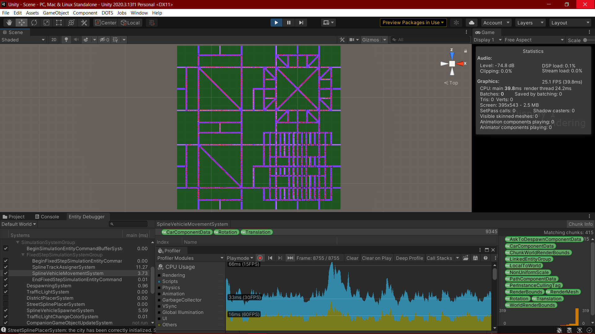
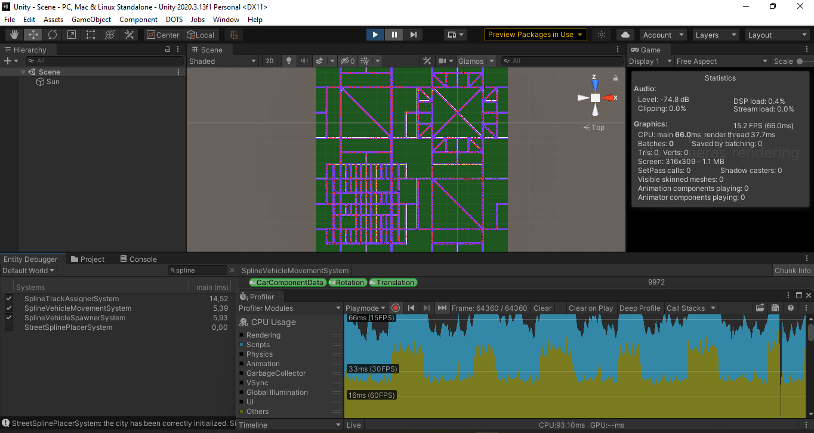

# Project report

This document is a summary of the work done to develop the traffic simulation project.

## Purpose of the project

The functional requirement of the project consists of a city traffic simulator, with a particular attention on its streets and vehicles.
The non-functional requirement is **high-scalability** in the number of vehicles and in general in the number of entities in the scene. Indeed, the purpose of the project is to evaluate the capabilities of Unity DOTS to support hundreds of thousands of entities in the scene at the same time.

## Dependencies

The developers have chosen not to use any external dependency, besides the core Unity libraries.

## How to run the benchmark

In UnityHub, install the Unity version 2020.3.13;, then from the `Projects` menu, open the `Unity` folder.
Once the project is fully loaded, change scene moving to the one called `Scene` and then just press play.

## The underlying technology: Unity DOTS

Unity recently offers two paradigms to build an application:

- Traditional stack: the well-established and mature approach to create three-dimensional (or bi-dimensional) programs in Unity, based on mono behaviours;
- DOTS: the Data-Oriented Technology Stack, a novel paradigm in building 3D (or 2D) applications. This is the target approach of this project.

DOTS is a paradigm that favours scalability in exchange for complexity. Hence, the data-oriented model suits projects that are characterized by a large or huge number of entities that obey to the same algorithm.

The community also talks about hybrid solutions, where mixing a small number of traditional scripts with DOTS is considered acceptable; in the context of this project, instead, the developers tried to stick to the Pure ECS paradigm, although Unity internally creates old-styled scripts anyway for some purposes.

## The first version of the project

The very first phase of the development approached the problem in a very flexible way. Essentially, the whole scene was created through scripts only. On one hand, this solution donated great flexibility since the input could be customized at a fine-grained level; on the other hand, generating all the components of the city on the fly came up to be time-consuming if compared to the results. The task was cumbersome for the final user as well, due to the great number of properties to configure.
Additionally, the developers at that time acknowledged their lack of experience on Unity and 3D frameworks overall.

The codebase is located on branch `version1` of the current repository.

## Why switching to the version 2?

After having explored the Unity ecosystem through the version 1 of this project, the developers switched to a new version. The reason of this was the need to increase the development process speed in exchange for a quite less customizability of the city, as discussed just above.

The former version can be considered as an *architectural spike*, namely a prototype that helps in going deeper into the specific domain of a project before proceeding to a complete solution.

## Version 2 characteristics

The second phase of the development process pertained the intent to build and deploy a full-fledged traffic simulator, on top of Unity DOTS. The paramount aspect of the second version is the usage of the physics to allow each component in the scene to interact with each other. The Physics package allows to reach a great degree of realism in the behaviour of the components inside the scene. For instance, cars continuously correct their trajectory along the lane, as in real life, rather than following invisible tracks.


An in-depth analysis on how the Physics package is exploited in version 2 is given in this same section of the README in the `version2` branch.

## Why switching to the version 3?

The developers, once again, realized that realism was not a requirement of the project, especially if it thwarts scalability at a very limited threshold. Indeed, using Physics means loading Unity with a pletora of computations: collision surfaces and points, raycast and spherecast interpolation, gravity application, force computations and so on. Even if systems were partially but reasonably optimized, the resulting number of cars at steady state was unsatisfying. Systems were not able to run in parallel and some bugs were in place, but the developers traced back the poor performances to the usage of physics, which is therefore intended for few entities.

## The  simulator

*The following part of the document describes the final design and implementation of the simulator (version 3).*

### What's the input of the simulator?

The developers have conceived a general city as a matrix made up of square districts. Each district has predefined characteristics in terms of density. The scene under simulation can be customized as described beneath.

1. The user writes the city matrix as a json file called `City.json`. The user validates the json file against the [schema](./Unity/Assets/Resources/citySchema.json) in order to probe any syntax error;
2. The user saves the file in `<UnityRootFolder>/Assets/Resources/City.json`, as it is automatically loaded by the simulator so as to build the intended city.

### How does the simulator work?

*This paragraph discusses the solutions adopted for each component of the simulator to get to work.*

#### The city is a grid of districts

Given the json file that describes the districts selected by the user, the simulator essentially spawns the districts and welds them incrementally.

#### The city is a graph

Once the simulator has instantiated all the streets and crosses of the city, it proceeds to build the internal data structures.
The inner data structure that represent the city is a cyclic directed graph. The developers created a simple dedicated library for graph management, since most of the available ones in the community are not compatible with Unity, like the NuGet QuickGraph.

#### Cars move along splines

Each street is divided in forward and backward lanes; each lane contains a certain number of points, i.e. nodes.
These nodes are placed dynamically at run time on the streets, at the very beginning of the simulation. The longest the street is, the more nodes it will contain. On the crosses and parking areas instead, developers have chosen to place the nodes statically, since each type of cross has a fixed size.

At runtime, each car proceeds node by node along a trajectory, i.e. spline, that is the linear interpolation of two successive nodes. Cars therefore follow a series of splines that are located across streets, crosses and parking areas.

Cars receive a random path at spawn time, that guides them from the source street/cross/parking area until the destination street/cross/parking area; the path is currently filled with streets and crosses choosen randomly.

#### Parking areas

They are intended as underground parking areas where cars go parking, technically despawn, or get out, technically spawn.
Those areas are very strong car spawning points but weak despawing points, since the car can randomly decide whether to enter or not when they are approaching the cross leading to the parking area.

#### Public transport

The simulator supports a circular bus transport system. Some streets act as bus stops, where buses spawn and despawn. The spawn frequency of buses is low if compared to that of cars.
The path between two successive bus stops is computed at runtime, during initialization phase; the user can instead specify which street should work as bus stop by adding to it a `BusStopComponentData`. The simulator can link bus stops even if they belong to different districts.
Note: if a street in a district prefab is eligible to become a bus stop, all instances of the same district prefab will have that bus stop in that street.

### Dynamic Camera

In order to assure the user the best experience with the simulator, it has been implemented a Dynamic Camera that allows to move freely inside the city and to look around, in a First Person View.
The camera system is the only monobehaviour set of scripts because it is not possible to convert it into an entity, since it is not supported by Unity ECS yet.
With this system, the user can literally fly inside the map, and the commands are:

- `WASD` to move on the XZ plane;
- `SPACE` and `LSHIFT` keys to move respectively up and down on the Y axis (min. Y = 40, max. Y = 800);
- moving the mouse allows to rotate the camera;
- `H` key to toggle on and off the mouse rotation.

For a better experience, if the camera is placed in a Y position lower than 70, the movements are slower so that the user can follow the vehicles more precisely, and if it is located in a Y position higher than 500, they are faster so that one can quickly change area.

#### Simulation Stats

During the simulation the user can view a stat panel attached to the camera that allows to keep track of some parameters such as:

- number of high/medium/low density districts;
- max number of active vehicles set for the simulation, if specified in `City.json` file
- current vehicle number (total, car number and bus number);
- number of despawned vehicles so far;
- number of spawned/despawned vehicles-per-second.

This panel can be toggled on and off by pressing the `T` key.

### The output of the simulator

This section describes the measures taken into account in order to evaluate the simulator, along with their actual values on the three developers' machines. It follows a discussion on the collected results.

Note: *All measures have been collected when the simulation was at steady state.*

Among all the resources that Unity shows in the profiler view, like Scripts, Garbage Collector, Physics and so on, just two of them are relevant for the present simulation: Scripts and Others; indeed, the remaining categories don't show any relevant measure.

The bottlenecks of the simulator are the two main systems which allows the vehicles to move: SplineVehicleMovementSystem (SVMS) and SplineTrackAssignerSystem (STAS).

#### Machine 1

Hardware characteristics of the machine used for the simulation:

- CPU: Intel(R) Core(TM) i7-7500U CPU @ 2.70GHz;
- RAM: 8.00 GB;
- GPU: NVIDIA GeForce MX130.

Measures:

| Simulation id |  | Districts  |  | # cars | # entities | # FPS | Total delay (ms) | SVMS delay (ms) | STAS delay (ms) |
| - |-------------|--------|------------|------| - | - | - | - | - |
|  | # low-density | # medium-density | # high-density | | | | | | |
| 1 | 1 | 0 | 0 | 1410 | 44184 | 99.6 | 10.0 | 0.18 | 0.61 |
| 2 | 1 | 1 | 0 | 4361 | 64075  | 63.2 | 15.8 | 0.45 | 1.59 |
| 3 | 2 | 1 | 1 | 9345 | 109862 | 25.1 | 39.8 | 3.73 | 11.27 |
| 4 | 2 | 2 | 2 | 15122 | 165129 | 14.9 | 67.0 | 7.21 | 21.48 |
| 5 | 3 | 3 | 2 | 19204 | 193847 | 9.2 | 108.4 | 15.30 | 46.28 |

The following figure shows the screenshot of the measures recorded for simulation with id 3:



#### Machine 2

Hardware characteristics of the machine used for the simulation:

- CPU: Intel(R) Core(TM) i7-6500U CPU @ 2.50GHz;
- RAM: 12.00 GB;
- GPU: NVIDIA GeForce 940MX.

Measures:

| Simulation id |  | Districts  |  | # cars | # entities | # FPS | Total delay (ms) | SVMS delay (ms) | STAS delay (ms) |
| - |-------------|--------|------------|------| - | - | - | - | - |
|  | # low-density | # medium-density | # high-density | | | |
| 1 | 1           |  0  |   0  | 2070 | 44760 | 92.2 | 10.8 | 0.21 | 0.70 |
| 2 | 1           |  1  |   0  | 5030 | 64850 | 61 | 16.4 | 0.80 | 2.90 |
| 3 | 2           |  1  |   1  | 9817 | 110291 | 24.4 | 40.9 | 4.44 | 12.35 |
| 4 | 2           |  2  |   2  | 15140 | 165004 | 10.1 | 99.0 | 19.14 | 46.65 |
| 5 | 3           |  3  |   2  | 20140 | 194906 | 4.3 | 234.4 | 50.83 | 134.58 |

The following figure shows the screenshot of the measures recorded for simulation with id 3:


#### Machine 3

Hardware characteristics of the machine used for the simulation:

- CPU: Intel(R) Core(TM) i3-8130U CPU @ 2.20GHz;
- RAM: 20.0 GB;
- GPU: Intel UHD Graphics 620.

Measures:

| Simulation id |  | Districts  |  | # cars | # entities | # FPS | Total Delay (ms) | SVMS delay (ms)| STAS delay (ms)|
| - |-------------|--------|------------|------| - | - | - | - | - |
|  | # low-density | # medium-density | # high-density | | | |
| 1 | 1           |  0  |   0  |  1958    | 44700 | 70 | 14 | 0.78 | 0.04 |
| 2 | 1           |  1  |   0  |   5893   | 65682 | 40 | 25| 1.03 | 3.31 |
| 3 | 2           |  1  |   1  |    9972  |110357  | 15  | 66.7 |5.39 |14.52 |
| 4 | 2           |  2  |   2  |   15256   |  165120 | 7 |142 |28.67 |48.11 |
| 5 | 3           |  3  |   2  |    18756  | 193522 | 4 | 250 | 41.23 |110.14 |

The following figure shows the screenshot of the measures recorded for simulation with id 3:



## Brief discussion on the collected results

The results between the three different machines are almost equivalent, if compared to the underlying hardware equipment.

At the end of the five runs, among the different machines, the maximum number of cars achieved is 20140 out of 194906 entities, at the same time.

## Brief description of each system

- DistrictPlacerSystem: instantiates and links the district specified in the input `City.json`. Then becomes inactive for the rest of the simulation;
- GraphGeneratorSystem: builds the underlying graph data structure given the spawned city. Then becomes inactive for the rest of the simulation;
- StreetSplinePlacerSystem: instantiates and positions all the nodes on streets that will later be interpolated to create the splines useful for vehicle movement. Then becomes inactive for the rest of the simulation;
- SplineTrackAssignerSystem: assigns the subsequent track to each car when it is at the end of a cross/street; it also initializes the data structures of just-spawned cars;
- SplineVehicleMovementSystem: creates the trajectory that each car follows, implemented as a linear interpolation of two successive nodes (Lerp);
- SplineVehicleSpawnerSystem: spawns cars in each lane; in more detail, the car is spawned in a specific node of the lane, if the street has at least 10 nodes;
- DespawningSystem: destroys all the entities that the simulator asked to;
- Domain: a container for POCOs (Plain-Old C# Object); it currently holds the model of the city, as described by the pertinent json [schema](./Unity/Assets/Resources/citySchema.json);
- TrafficLightSystem: given each cross, logically decides which semaphore has the turn;
- TrafficLightChangeColorSystem: decides the color of a given traffic light based on the turn;
- BusPathFinderSystem: computes the minimum path between two bus stops, for each bus stop in the city; the path toward the next bus stop is assigned once to the current bus stop, since a bus should always follow the same path;
- SemaphoreStateAssignerSystem: a minor system that makes streets aware of their current semaphore state (green or red).

## Life cycle of the simulation

At the start of a simulation, these systems are called only once and then disabled, in this order:

1. DistrictPlacerSystem;
2. GraphGeneratorSystem;
3. BusPathFinderSystem;
4. StreetSplinePlacerSystem;
5. SemaphoreStateAssignerSystem.

The remaining systems, in charge of performing the simulation, run without any specific order.

## Last considerations

### What are the achievements?

The current project shed light on some points:

- Physics is heavy for the Unity engine to render, due to the great number of underlying computations; few entities should behave according to real-world physics, like the main player in a computer game. The version 2 is the example that demonstrates this aspect;
- It is sometimes convenient to fill in data structures manually, i.e. from the editor, although this may be tedious and repetitive; other times, it is better to automate the same task though scripts, although general formulas are quite complex to grasp. The version 1 of the current project is an example, where the developers tried to instantiate streets and crosses (along with their direction, rotation and so on) from scripts; this task came up to be flexible but complex and unnecessary.

There are also other observations but, since they are more close to implementation aspects, they are not mentioned here.

### How to enhance the project?

The suggested path comprises the following improvements:

- Wider streets, with more than two lanes per direction: this enhancement is expected to add some complexity to the simulator, which should make the results of the simulation get worse; some optimizations should however put the results back at the current values;
- Curved streets: this is an aesthetical improvement, since it implies effort just to model the streets in Blender and a more general algorithm to place splines along them; the simulation results are not expected to change;
- Uphills and downhills: the same considerations of curved streets subsist also here;
- Different types of cars: this task surely would add complexity to the simulation, but it would add value to the project;
- A public transport circuit: the same considerations of adding different types of car subsist also here.

### How to generate a new district?

If the user wants to create a new district, he/she needs to keep in mind that each district has a fixed size and 12 fixed exit streets, 3 per side. These streets have a flag that indicates that they are border streets, connected only by one side (the district itself). Each border street is numbered from 1 to 12, as it is for instance in the district sm-1.


Starting from this, the user can have fun creating a new district exploiting the available crosses, streets and parking areas prefabs.

The system relies on some conventions about the city organization that have to be taken into account in order to build a district that the simulator can recognize.

Streets, crosses and parking areas within a district must be mutually linked, by following these conventions:

- Crosses: *in the Unity editor, position the view on the cross to link, such that the local Z is pointing to the top street. Starting from this, all the other needed streets can ben mutually linked (on top, right and so on);*
- Streets: *in the Unity editor, position the view on the street to link, such that the local Z points towards the ending cross of the street.*
- Parking Areas: *in the Unity editor, position the view on the parking area to link, such that the local Z points towards the cross to link (which is both starting and ending cross)*

After completing the new district, the user may create a new prefab starting from the scene, with a given name. It is suggested to follow the developers' naming rule:

- "sm-#" for **low** street density districts;
- "md-#" for **medium** street density districts;
- "lg-#" for **high** street density districts.

This new district prefab needs to be added to the empty gameobject called Prefabs, in particular inside its "Prefabs Component Data".

After that, open the citySchema.json file, and add the new district name in the enum list. Then copy the entire citySchema.json content, and paste it in [QuickType](https://app.quicktype.io/) to generate the C# class starting from this json schema.


Then copy the obtained C# class and overwrite the Domain C# script in the Systems folder.

Finally open DistrictPlacerSystem and add the new district in the two switch cases, taking as example the existing ones.

### How to spawn a different city?

The user can easily configure a city by modifing the `City.json` file located in `<UnityRootFolder>/Assets/Resources/city.json`. The file is structured as a matrix of districts. Each district is specified through its name. An example follows below:

```json
{
    "districts": [
        ["sm-1", "md-1"],
        ["sm-1", "lg-1"]
    ]
}
```


The user may specify in `City.json` the maximum number of active vehicles in the simulation by adding the `"maxVehicleNumber"`.
It follows an example, if the user wants to cap the vehicle number to 4000 he/she can:

 ```json
{
    "districts": [
        ["sm-1", "md-1"],
        ["sm-1", "lg-1"]
    ], 
    "maxVehicleNumber": 4000
}
```

This is an optional field, if not specified there will be no constraints in that sense.
